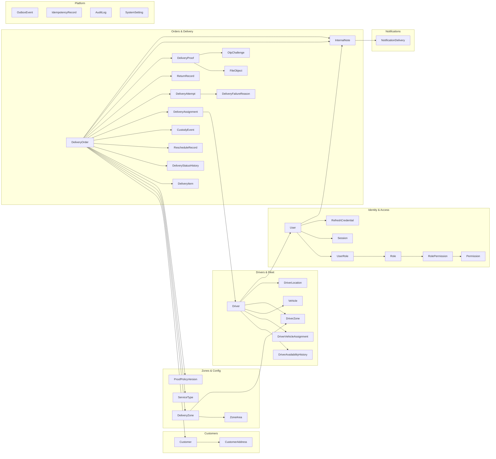
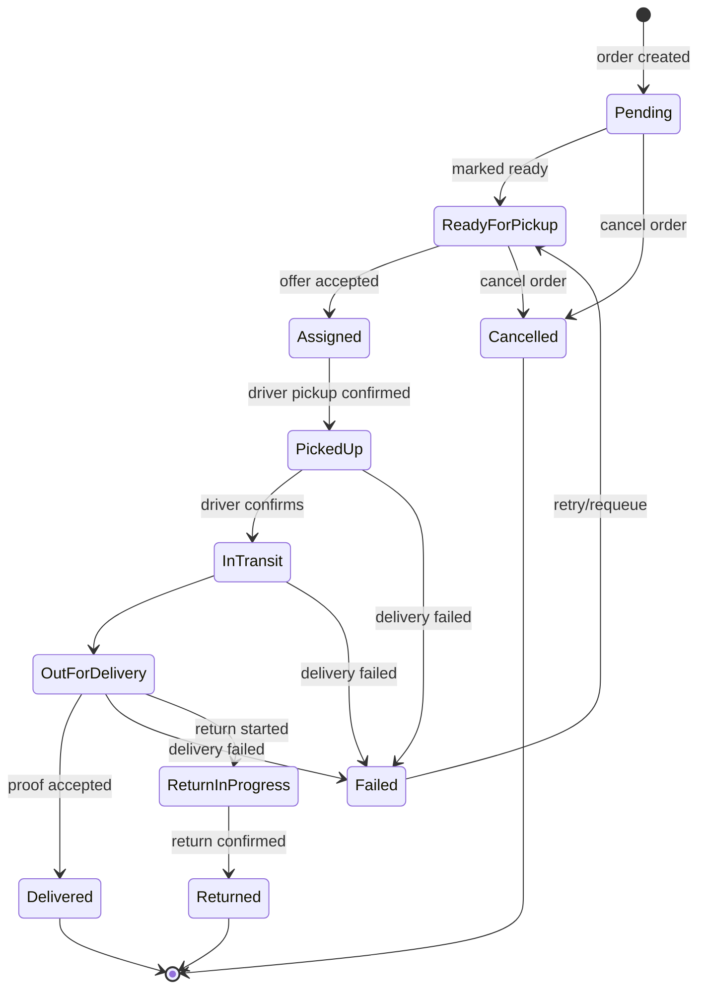
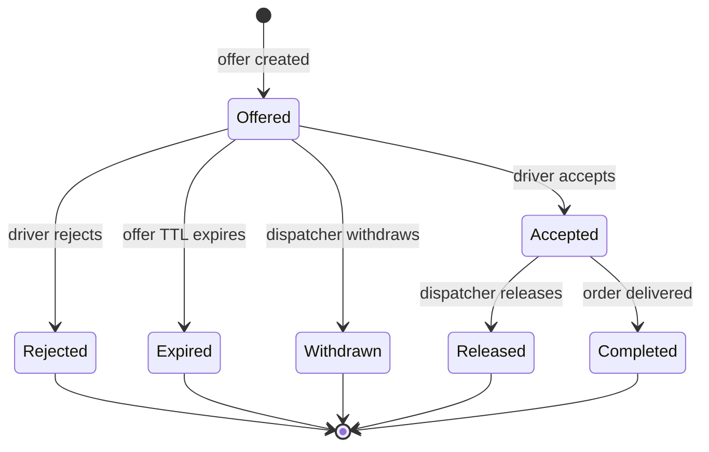

# Deliverix — Entity Relationship Diagram

Full data model for the Delivery Management System backend (Prisma schema: `prisma/schema.prisma`).

---

## Core ERD

```mermaid
erDiagram
    User {
        string id PK "cuid"
        string email UK
        string passwordHash
        string name
        string phone
        UserAccountStatus status
        boolean mfaEnabled
        string mfaSecretCipher
        uint version
        datetime createdAt
        datetime updatedAt
    }

    Role {
        string id PK
        string name UK
        uint version
    }

    Permission {
        string id PK
        string code UK
        string description
    }

    UserRole {
        string id PK
        string userId FK
        string roleId FK
    }

    RolePermission {
        string id PK
        string roleId FK
        string permissionId FK
    }

    Session {
        string id PK
        string userId FK
        string refreshTokenId
        string ip
        string userAgent
        boolean revoked
        nullable mfaToken
        datetime expiresAt
    }

    RefreshCredential {
        string id PK
        string userId FK
        string familyId
        string tokenHash
        datetime expiresAt
        boolean revoked
        nullable datetime revokedAt
        nullable string replacedBy
    }

    User ||--o{ UserRole : has
    User ||--o{ Session : creates
    User ||--o{ RefreshCredential : owns
    Role ||--o{ UserRole : granted_to
    Role ||--o{ RolePermission : includes
    Permission ||--o{ RolePermission : required_by

    Customer {
        string id PK
        string name
        string email
        string emailNormalized UK
        string phone
        string phoneNormalized UK
        string accountId FK "→ User"
        string status
        uint version
    }

    CustomerAddress {
        string id PK
        string customerId FK
        string label
        string addressLine1
        string city
        string state
        string country
        string postalCode
        nullable decimal latitude
        nullable decimal longitude
    }

    Customer ||--o{ CustomerAddress : has
    Customer }o--|| User : represented_by

    Driver {
        string id PK
        string driverCode UK
        string accountId FK "→ User"
        string contactPhone
        string licenseNumber
        datetime licenseExpiry
        boolean active
        DriverAvailabilityState state
        uint version
    }

    DriverAvailabilityHistory {
        string id PK
        string driverId FK
        DriverAvailabilityState previousState
        DriverAvailabilityState newState
        string reasonCode
        string actorId
        datetime changedAt
    }

    DriverVehicleAssignment {
        string id PK
        string driverId FK
        string vehicleId FK
        datetime assignedFrom
        nullable datetime assignedTo
        string reasonCode
        string assignedById
    }

    DriverZone {
        string id PK
        string driverId FK
        string zoneId FK
        boolean allowed
    }

    Vehicle {
        string id PK
        string vehicleCode UK
        string registrationNumber UK
        string model
        string capacity
        VehicleOperationalStatus status
        uint version
    }

    Driver ||--o{ DriverAvailabilityHistory : transition
    Driver ||--o{ DriverVehicleAssignment : assigned_vehicle
    Driver ||--o{ DriverZone : covers
    Driver ||--o| User : account
    Vehicle ||--o{ DriverVehicleAssignment : allocated
    DriverZone }o--|| DeliveryZone : zone

    DeliveryZone {
        string id PK
        string name UK
        string code UK
        boolean active
        int priority
        decimal deliveryFee
        string currencyCode
    }

    ZoneArea {
        string id PK
        string zoneId FK
        string name
        decimal latitude
        decimal longitude
        decimal radiusMeters
        json polygon
        boolean active
    }

    ServiceType {
        string id PK
        string name
        string code UK
        boolean active
        uint version
    }

    ProofPolicyVersion {
        string id PK
        string policyVersion UK
        datetime effectiveFrom
        boolean requiresRecipientName
        boolean requiresPhoto
        boolean requiresSignature
        boolean requiresConfirmation
        boolean requiresOtp
        int minPhotos
        boolean active
    }

    DeliveryZone ||--o{ ZoneArea : contains
    DeliveryZone ||--o{ DeliveryOrder : serves
    ServiceType ||--o{ DeliveryOrder : classifies
    ProofPolicyVersion ||--o{ DeliveryOrder : governs

    DeliveryOrder {
        string id PK
        string orderNumber UK
        OrderStatus status
        string customerId FK
        string serviceTypeId FK
        string proofPolicyId FK
        string zoneId FK
        string createdById FK "→ User"
        json pickupAddress
        json deliveryAddress
        string pickupInstructions
        string deliveryInstructions
        datetime promisedAtStart
        datetime promisedAtEnd
        datetime rescheduledAtStart
        datetime rescheduledAtEnd
        decimal deliveryFee
        string currencyCode
        string packageNote
        boolean pickupPhotoRequired
        datetime readyAt
        datetime pickedUpAt
        datetime deliveredAt
        datetime cancelledAt
        datetime failedAt
        datetime returnedAt
        uint version
    }

    DeliveryItem {
        string id PK
        string orderId FK
        string name
        string description
        int quantity
        decimal weight
        string weightUnit
        decimal lengthCm
        decimal widthCm
        decimal heightCm
    }

    DeliveryStatusHistory {
        string id PK
        string orderId FK
        OrderStatus fromStatus
        OrderStatus toStatus
        string actorId
        string actorType
        string reasonCode
        string reasonText
        string requestId
        uint version
        datetime createdAt
    }

    DeliveryAssignment {
        string id PK
        string orderId FK
        string driverId FK
        AssignmentStatus status
        string assignedById
        datetime offerExpiresAt
        datetime offeredAt
        datetime acceptedAt
        datetime rejectedAt
        datetime withdrawnAt
        datetime releasedAt
        datetime completedAt
        string reasonCode
        string reasonText
        uint version
    }

    DeliveryAttempt {
        string id PK
        string orderId FK
        int attemptNumber
        AttemptStatus status
        datetime startedAt
        datetime endedAt
        string failureReasonId FK
        string failureReasonText
    }

    DeliveryFailureReason {
        string id PK
        string code UK
        string label
        boolean requiresText
        boolean active
    }

    RescheduleRecord {
        string id PK
        string orderId FK
        datetime previousStart
        datetime previousEnd
        datetime newStart
        datetime newEnd
        string reasonCode
        string reasonText
        string actorId
    }

    CustodyEvent {
        string id PK
        string orderId FK
        CustodyKind fromKind
        string fromHolderId
        CustodyKind toKind
        string toHolderId
        string reasonCode
        string actorId
        datetime occurredAt
    }

    DeliveryOrder ||--o{ DeliveryItem : contains
    DeliveryOrder ||--o{ DeliveryStatusHistory : transitions
    DeliveryOrder ||--o{ DeliveryAssignment : assigned_through
    DeliveryOrder ||--o{ DeliveryAttempt : attempted_via
    DeliveryOrder ||--o{ RescheduleRecord : rescheduled_by
    DeliveryOrder ||--o{ CustodyEvent : custody_trace
    DeliveryOrder }o--|| Customer : placed_by
    DeliveryAssignment }o--|| Driver : served_by
    DeliveryAttempt }o--|| DeliveryOrder : belongs_to
    DeliveryAttempt }o--o| DeliveryFailureReason : fails_with

    ReturnRecord {
        string id PK
        string orderId FK
        string attemptId FK
        string reasonCode
        string reasonText
        string createdById
        ReturnStatus status
        string evidenceId FK "→ FileObject"
        datetime returnedAt
        datetime confirmedAt
        string confirmedById
    }

    DeliveryProof {
        string id PK
        string orderId FK
        string attemptId FK
        ProofEvidenceType evidenceType
        string recipientName
        string fileObjectId FK
        string otpChallengeId FK "→ OtpChallenge"
        decimal latitude
        decimal longitude
        ProofStatus status
        string rejectedReason
        string submittedById
        datetime submittedAt
        datetime verifiedAt
        datetime correctedAt
        string correctedById
    }

    DeliveryOrder ||--o{ ReturnRecord : returned_through
    DeliveryOrder ||--o{ DeliveryProof : evidenced_by
    DeliveryAttempt }o--o{ DeliveryProof : submitted_against

    FileObject {
        string id PK
        string orderId FK "nullable"
        string attemptId FK "nullable"
        string provider
        string key UK
        string originalName
        string mimeType
        int sizeBytes
        FileStatus status
        string uploadedById
        datetime uploadedAt
        datetime scannedAt
        string scanResult
        datetime expiresAt
    }

    OtpChallenge {
        string id PK
        string orderId FK "nullable"
        OtpPurpose purpose
        string identifier
        string challengeHash
        datetime expiresAt
        int attemptsLeft
        datetime consumedAt
        datetime resentAt
        string createdById
    }

    FileObject ||--o{ DeliveryProof : provides_evidence
    FileObject }o--o| ReturnRecord : evidences_return
    OtpChallenge ||--o{ DeliveryProof : verifies
    DeliveryOrder ||--o{ FileObject : has_files
    DeliveryOrder ||--o{ OtpChallenge : challenges

    DriverLocation {
        string id PK
        string driverId FK
        string assignmentId FK "nullable"
        datetime capturedAt
        datetime receivedAt
        decimal latitude
        decimal longitude
        decimal accuracyMeters
    }

    Driver ||--o{ DriverLocation : reports_position

    InternalNote {
        string id PK
        string orderId FK
        string authorId FK "nullable"
        string body
        datetime createdAt
    }

    DeliveryOrder ||--o{ InternalNote : has_notes

    Notification {
        string id PK
        string userId FK
        string orderId FK "nullable"
        string type
        string title
        string message
        NotificationChannel channel
        json payload
        datetime readAt
        datetime createdAt
    }

    NotificationDelivery {
        string id PK
        string notificationId FK
        NotificationChannel channel
        NotificationDeliveryStatus status
        string providerRef
        int attempts
        datetime nextRetryAt
        string lastError
        datetime sentAt
    }

    User ||--o{ Notification : receives
    DeliveryOrder ||--o{ Notification : notifies
    Notification ||--o{ NotificationDelivery : delivered_via

    OutboxEvent {
        string id PK
        string eventType
        string eventVersion
        string aggregateType
        string aggregateId
        json payload
        OutboxStatus status
        int attempts
        datetime availableAfter
        datetime processedAt
        string lastError
        string traceId
        datetime occurredAt
    }

    IdempotencyRecord {
        string id PK
        string scopeKey
        string operation
        string key
        string requestHash
        json response
        IdempotencyStatus status
        datetime expiresAt
    }

    AuditLog {
        string id PK
        string actorId FK "nullable"
        string actorType
        string action
        string resourceType
        string resourceId
        json before
        json after
        string reason
        string requestId
        string ip
        string result
        datetime occurredAt
    }

    User ||--o{ AuditLog : produces_audit

    SystemSetting {
        string id PK
        string key UK
        json value
        string description
        boolean allowedValuesConstrained
        json allowedValues
        string updatedById
    }
```

---

## Domain Context Diagram



---

## State Machine (Order)



---

## State Machine (Assignment)



---

## Index Highlights

| Table | Index | Purpose |
|---|---|---|
| `delivery_orders` | `(customer_id)` | Customer order lookups |
| `delivery_orders` | `(status, created_at)` | Queue/report queries |
| `delivery_assignments` | `(order_id, status)` | Open-assignment checks |
| `delivery_assignments` | `(driver_id, status)` | Driver capacity checks |
| `delivery_assignments` | `(status, offer_expires_at)` | Offer-expiration job polling |
| `outbox_events` | `(status, available_after)` | Outbox dispatch job polling |
| `notification_deliveries` | `(status, next_retry_at)` | Notification retry job polling |
| `audit_logs` | `(resource_type, resource_id)` | Traceability queries |
| `file_objects` | `(status, uploaded_at)` | File-cleanup job polling |
| `driver_locations` | `(received_at)` | Retention cleanup |

---

## Data Retention (days)

| Dataset | Retention | Controller |
|---|---|---|
| Idempotency records | Per-key expiry (24h) | `IdempotencyRecord.expiresAt` |
| OTP challenges | 5 min TTL | `OtpChallenge.expiresAt` |
| Notifications | 90 days | `retention.notification_days` / `RETENTION_NOTIFICATION_DAYS` |
| Delivered outbox events | 30 days | `RETENTION_OUTBOX_DAYS` |
| GPS history | 30 days | `RETENTION_GPS_DAYS` |
| Accepted proof files | 180 days (after terminal order) | `RETENTION_PROOF_FILE_DAYS` |

---

*Generated from `prisma/schema.prisma` (891 lines, 38 models, 14 enums).*