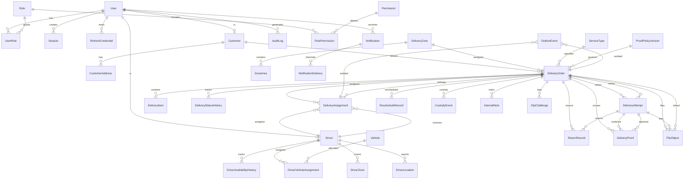

# Deliverix — Delivery Management System Backend

A production-grade RESTful API for managing end-to-end delivery operations: order lifecycle, driver dispatch, real-time tracking, proof-of-delivery, and operational reporting.

---

## Table of Contents

- [Tech Stack](#tech-stack)
- [Getting Started](#getting-started)
- [Environment Variables](#environment-variables)
- [Folder Structure](#folder-structure)
- [Entity Relationship Diagram](#entity-relationship-diagram)
- [API Reference](#api-reference)
- [Authentication & Authorization](#authentication--authorization)
- [Architecture Decisions](#architecture-decisions)
- [Background Jobs](#background-jobs)
- [Error Handling](#error-handling)
- [Testing](#testing)
- [Deployment](#deployment)

---

## Tech Stack

| Layer | Technology |
|---|---|
| Runtime | Node.js ≥ 20.9 |
| Language | TypeScript 5.8 (strict mode, ESM) |
| Framework | Express 5.1 |
| ORM | Prisma 7.10 |
| Database | PostgreSQL |
| Validation | Zod 3.25 |
| Auth | JWT (access + refresh), Argon2id, TOTP MFA |
| Email | Nodemailer + SMTP |
| Object Storage | Cloudinary |
| Background Jobs | node-cron + PostgreSQL polling |
| Logging | Pino |
| API Standards | REST, RFC 9457 problem+json |

---

## Getting Started

### Prerequisites

- Node.js ≥ 20.9
- PostgreSQL 14+
- Cloudinary account (optional — mock fallback when unconfigured)
- SMTP server (optional — mock fallback when unconfigured)

### Installation

```bash
git clone https://github.com/your-org/deliverix.git
cd deliverix
cp .env.example .env        # configure environment variables
npm install                  # installs deps + runs prisma generate
```

### Database Setup

```bash
npm run db:migrate           # apply migrations
npm run db:seed              # seed roles, permissions, admin user
```

Default admin credentials after seeding:
- **Email:** `admin@deliverix.local`
- **Password:** `Deliverix-Admin-1`

### Development

```bash
npm run dev                  # starts tsx watch on port 3000
```

### Production Build

```bash
npm run build                # prisma generate + tsc
npm run start                # node dist/index.js
```

---

## Environment Variables

| Variable | Required | Default | Description |
|---|---|---|---|
| `NODE_ENV` | No | `development` | `development` / `test` / `production` |
| `PORT` | No | `3000` | HTTP listen port |
| `DATABASE_URL` | **Yes** | — | PostgreSQL connection string |
| `JWT_ACCESS_SECRET` | **Yes** | — | Min 32 chars; signs access JWTs |
| `JWT_REFRESH_SECRET` | **Yes** | — | Min 32 chars; signs refresh tokens |
| `JWT_ACCESS_TTL` | No | `15m` | Access token lifetime |
| `JWT_REFRESH_TTL` | No | `7d` | Refresh token lifetime |
| `MFA_ISSUER` | No | `Deliverix` | TOTP issuer label |
| `ARGON2_MEMORY_KIB` | No | `19456` | Argon2id memory cost |
| `ARGON2_TIME` | No | `2` | Argon2id iterations |
| `ARGON2_PARALLELISM` | No | `1` | Argon2id parallelism |
| `CORS_ORIGINS` | No | `http://localhost:3000` | Comma-separated allowed origins |
| `LOG_LEVEL` | No | `info` | Pino log level |
| `LOG_PRETTY` | No | `false` | Pretty-print logs |
| `RATE_LIMIT_WINDOW_MS` | No | `60000` | Global rate-limit window (ms) |
| `RATE_LIMIT_MAX` | No | `100` | Max requests per window |
| `SMTP_HOST` | No | — | SMTP host; omit for mock mode |
| `SMTP_PORT` | No | `587` | SMTP port |
| `SMTP_USER` | No | — | SMTP username |
| `SMTP_PASS` | No | — | SMTP password |
| `SMTP_FROM` | No | `noreply@deliverix.local` | Sender address |
| `CLOUDINARY_CLOUD_NAME` | No | — | Cloudinary cloud; omit for mock |
| `CLOUDINARY_API_KEY` | No | — | Cloudinary API key |
| `CLOUDINARY_API_SECRET` | No | — | Cloudinary API secret |

---

## Folder Structure

```
deliverix/
├── Docs/
│   ├── SRS.md                              # Software Requirements Specification (v2.0)
│   ├── Project_Implementation_Plan.md      # Phase-by-phase implementation plan
│   └── ERD.md                              # Full entity-relationship diagram
│
├── prisma/
│   ├── schema.prisma                       # Data model (38 models, 14 enums)
│   ├── seed.ts                             # Seed: 25 permissions, 5 roles, admin user
│   ├── prisma.config.ts                    # Prisma configuration
│   └── migrations/                         # Database migrations
│
├── src/
│   ├── index.ts                            # Server bootstrap, graceful shutdown
│   ├── app.ts                              # Express app factory, middleware, route mounting
│   │
│   ├── config/
│   │   ├── env.ts                          # Zod-validated environment config
│   │   └── constants.ts                    # Pagination, order-number, token constants
│   │
│   ├── modules/                            # Feature modules (17 total)
│   │   ├── auth/                           # Login, MFA, refresh, invitation, password reset
│   │   │   ├── auth.controller.ts
│   │   │   ├── auth.routes.ts
│   │   │   ├── auth.schemas.ts
│   │   │   └── auth.service.ts
│   │   ├── users/                          # User CRUD, role assignment
│   │   ├── roles/                          # Role listing
│   │   ├── customers/                      # Customer CRUD, addresses
│   │   ├── orders/                         # Order lifecycle, status transitions, notes
│   │   │   ├── order-number.service.ts     # Unique order-number generation
│   │   │   └── ...
│   │   ├── zones/                          # Delivery zones, area definitions
│   │   ├── service-types/                  # Service type config
│   │   ├── config-management/              # Failure reasons, proof policies, system settings
│   │   ├── drivers/                        # Driver CRUD, availability, self-service
│   │   ├── vehicles/                       # Vehicle CRUD, allocate/deallocate
│   │   ├── dispatch/                       # Queue, workloads, assignments (create/accept/reject/withdraw/reassign)
│   │   │   ├── assignment.service.ts       # Core dispatch logic with advisory locks
│   │   │   └── ...
│   │   ├── delivery/                       # Full delivery lifecycle + proof-of-delivery
│   │   │   ├── delivery.service.ts         # Pickup → InTransit → OutForDelivery → Delivered/Failed
│   │   │   ├── proof.service.ts            # Proof submission, OTP, verification
│   │   │   └── ...
│   │   ├── files/                          # Upload, scan, signed URLs (Cloudinary + multer)
│   │   ├── notifications/                  # In-app notification center
│   │   ├── reports/                        # Dashboard, delivery/driver/zone reports
│   │   └── audit/                          # Immutable audit log (read-only)
│   │
│   ├── jobs/                               # Background job infrastructure
│   │   ├── scheduler.ts                    # node-cron registration, graceful shutdown
│   │   ├── lib/
│   │   │   ├── job-runner.ts               # Generic PostgreSQL polling runner
│   │   │   └── job-lock.ts                 # Advisory lock helpers
│   │   └── handlers/
│   │       ├── offer-expiration.ts         # Expire pending driver offers (30s)
│   │       ├── outbox-dispatch.ts          # Outbox → notifications (10s)
│   │       ├── notification-retry.ts       # Retry failed deliveries (60s)
│   │       ├── file-cleanup.ts             # Abandoned upload cleanup (hourly)
│   │       └── retention-cleanup.ts        # Data retention enforcement (daily)
│   │
│   ├── integrations/                       # External provider adapters
│   │   ├── email/
│   │   │   ├── email.interface.ts           # EmailAdapter interface
│   │   │   ├── nodemailer.adapter.ts        # Nodemailer implementation
│   │   │   └── templates/                   # HTML email templates
│   │   └── storage/
│   │       ├── storage.interface.ts          # StorageProvider interface
│   │       └── cloudinary.adapter.ts        # Cloudinary implementation
│   │
│   └── shared/                              # Cross-cutting concerns
│       ├── errors/
│       │   ├── app-error.ts                 # Custom AppError class
│       │   ├── error-codes.ts              # Stable RFC-style error codes
│       │   └── error-handler.ts            # Express error middleware
│       ├── middleware/
│       │   ├── authenticate.ts              # JWT verification, cookie extraction
│       │   ├── authorize.ts                # RBAC permission check
│       │   ├── idempotent.ts               # Idempotency-Key header handling
│       │   ├── rate-limiter.ts             # Per-route rate limiting
│       │   ├── request-id.ts               # X-Request-Id propagation
│       │   ├── require-owner.ts            # Ownership validation
│       │   ├── require-version.ts          # If-Match / ETag
│       │   └── validate.ts                 # Zod schema validation
│       ├── types/
│       │   ├── express.d.ts                # Express type augmentations
│       │   ├── api.ts                      # API types
│       │   └── pagination.ts               # Cursor pagination types
│       └── utils/
│           ├── audit.ts                    # writeAudit helper
│           ├── bcrypt.ts                   # Password hashing (Argon2)
│           ├── crypto.ts                   # Secure random generators
│           ├── cursor.ts                   # Cursor encode/decode
│           ├── jwt.ts                      # JWT sign/verify
│           ├── logger.ts                   # Pino logger
│           └── prisma.ts                   # Prisma client singleton
│
├── tests/                                  # Test suites (skeleton)
│   ├── unit/
│   ├── integration/
│   ├── api-contract/
│   ├── authorization/
│   ├── concurrency/
│   ├── e2e/
│   ├── security/
│   ├── provider-failure/
│   ├── performance/
│   └── migration/
│
├── .env.example                            # Environment variable template
├── .gitignore
├── tsconfig.json                           # Strict TypeScript config
├── package.json
└── README.md
```

---

## Entity Relationship Diagram

> Full diagram in [`Docs/ERD.md`](Docs/ERD.md). Core entities shown below.



### Enum Reference

| Enum | Values |
|---|---|
| `OrderStatus` | `Pending` → `ReadyForPickup` → `Assigned` → `PickedUp` → `InTransit` → `OutForDelivery` → `Delivered` \| `Failed` \| `Cancelled` \| `ReturnInProgress` → `Returned` |
| `AssignmentStatus` | `Offered` → `Accepted` → `Completed` \| `Rejected` \| `Expired` \| `Withdrawn` \| `Released` |
| `DriverAvailabilityState` | `Offline`, `Available`, `Assigned`, `OnDelivery`, `Unavailable` |
| `UserAccountStatus` | `Invited`, `Active`, `Inactive`, `Suspended` |
| `FileStatus` | `Uploaded`, `Scanning`, `Accepted`, `Rejected`, `FailedProcessing` |
| `ProofEvidenceType` | `RecipientName`, `Photo`, `Signature`, `ConfirmationFlag`, `Otp` |
| `NotificationChannel` | `InApp`, `Email` |
| `OutboxStatus` | `Pending`, `Processing`, `Delivered`, `Failed`, `DeadLettered` |

---

## API Reference

**Base URL:** `http://localhost:3000/api/v1`

All responses use standard JSON. Errors follow [RFC 9457 problem+json](https://www.rfc-editor.org/rfc/rfc9457):

```json
{
  "type": "https://api.deliverix.local/errors/RESOURCE_NOT_FOUND",
  "title": "Not Found",
  "status": 404,
  "detail": "Order not found",
  "code": "RESOURCE_NOT_FOUND",
  "requestId": "req_abc123"
}
```

### Health (2 endpoints)

| Method | Endpoint | Auth | Description |
|---|---|---|---|
| `GET` | `/health/live` | No | Liveness probe |
| `GET` | `/health/ready` | No | Readiness probe (checks DB connectivity) |

| Method | Endpoint | Auth | Rate Limit | Description |
|---|---|---|---|---|
| `POST` | `/auth/login` | No | 20/60s | Email + password login |
| `POST` | `/auth/mfa/verify` | No | 20/60s | TOTP MFA verification |
| `POST` | `/auth/refresh` | No | — | Refresh access token |
| `POST` | `/auth/logout` | Yes | — | Revoke current session |
| `POST` | `/auth/logout-all` | Yes | — | Revoke all sessions |
| `POST` | `/auth/forgot-password` | No | 5/60s | Request password reset |
| `POST` | `/auth/reset-password` | No | 5/60s | Set new password via token |
| `POST` | `/auth/accept-invitation` | No | — | Complete invited user signup |
| `GET` | `/auth/me` | Yes | — | Current user profile |
| `POST` | `/auth/mfa/enrollment` | Yes | — | Generate TOTP secret + QR |
| `POST` | `/auth/mfa/enrollment/confirm` | Yes | — | Confirm MFA enrollment |

### Users (5 endpoints)

| Method | Endpoint | Permission | Description |
|---|---|---|---|
| `GET` | `/users/` | `users.view` | List users (cursor pagination) |
| `POST` | `/users/` | `users.manage` | Create user |
| `GET` | `/users/:id` | `users.view` | Get user by ID |
| `PATCH` | `/users/:id` | `users.manage` | Update user |
| `PUT` | `/users/:id/roles` | `users.manage` | Replace user roles |

### Customers (8 endpoints)

| Method | Endpoint | Permission | Description |
|---|---|---|---|
| `GET` | `/customers/` | `customers.view` | List customers |
| `POST` | `/customers/` | `customers.manage` | Create customer |
| `GET` | `/customers/:id` | `customers.view` | Get customer |
| `PATCH` | `/customers/:id` | `customers.manage` | Update customer |
| `GET` | `/customers/:id/addresses` | `customers.view` | List addresses |
| `POST` | `/customers/:id/addresses` | `customers.manage` | Add address |
| `PATCH` | `/customers/:id/addresses/:addrId` | `customers.manage` | Update address |
| `DELETE` | `/customers/:id/addresses/:addrId` | `customers.manage` | Remove address |

### Orders (9 endpoints)

| Method | Endpoint | Permission | Description |
|---|---|---|---|
| `POST` | `/orders/` | `orders.create` | Create order |
| `GET` | `/orders/` | `orders.view` | List orders (cursor pagination) |
| `GET` | `/orders/:id` | `orders.view` | Get order |
| `PATCH` | `/orders/:id` | `orders.edit` | Update order |
| `POST` | `/orders/:id/ready` | `orders.edit` | Mark ready for pickup |
| `POST` | `/orders/:id/cancel` | `orders.cancel` | Cancel order |
| `GET` | `/orders/:id/history` | `orders.view` | Status transition history |
| `GET` | `/orders/:id/notes` | `orders.view` | List internal notes |
| `POST` | `/orders/:id/notes` | `orders.internal-notes` | Add internal note |

### Drivers (7 endpoints)

| Method | Endpoint | Permission | Description |
|---|---|---|---|
| `GET` | `/drivers/` | `drivers.view` | List drivers |
| `POST` | `/drivers/` | `drivers.manage` | Create driver |
| `GET` | `/drivers/:id` | `drivers.view` | Get driver |
| `PATCH` | `/drivers/:id` | `drivers.manage` | Update driver |
| `GET` | `/drivers/me` | `deliveries.execute` | Self-service profile |
| `PUT` | `/drivers/me/availability` | `deliveries.execute` | Set availability state |
| `GET` | `/drivers/me/assignments` | `deliveries.execute` | View own assignments |

### Vehicles (6 endpoints)

| Method | Endpoint | Permission | Description |
|---|---|---|---|
| `GET` | `/vehicles/` | `drivers.view` | List vehicles |
| `POST` | `/vehicles/` | `drivers.manage` | Create vehicle |
| `GET` | `/vehicles/:id` | `drivers.view` | Get vehicle |
| `PATCH` | `/vehicles/:id` | `drivers.manage` | Update vehicle |
| `POST` | `/vehicles/:id/allocate` | `drivers.manage` | Assign to driver |
| `POST` | `/vehicles/:id/deallocate` | `drivers.manage` | Unassign from driver |

### Dispatch & Assignments (8 endpoints)

| Method | Endpoint | Permission | Description |
|---|---|---|---|
| `POST` | `/orders/:orderId/assignments` | `dispatch.assign` | Create assignment offer |
| `POST` | `/orders/:orderId/reassign` | `dispatch.reassign` | Reassign to different driver |
| `POST` | `/assignments/:id/accept` | `deliveries.execute` | Accept offer |
| `POST` | `/assignments/:id/reject` | `deliveries.execute` | Reject offer |
| `POST` | `/assignments/:id/withdraw` | `dispatch.reassign` | Withdraw offer |
| `GET` | `/dispatch/queue` | `dispatch.view-queue` | View dispatch queue |
| `GET` | `/dispatch/workloads` | `dispatch.view-queue` | Driver workload stats |
| `GET` | `/dispatch/orders/:orderId/assignments` | `dispatch.view-queue` | Assignment history |

### Delivery Lifecycle (13 endpoints)

| Method | Endpoint | Permission | Description |
|---|---|---|---|
| `POST` | `/orders/:orderId/pickup` | `deliveries.execute` | Confirm pickup |
| `POST` | `/orders/:orderId/in-transit` | `deliveries.execute` | Mark in transit |
| `POST` | `/orders/:orderId/out-for-delivery` | `deliveries.execute` | Out for delivery |
| `POST` | `/orders/:orderId/deliver` | `deliveries.execute` | Mark delivered |
| `POST` | `/orders/:orderId/fail` | `deliveries.execute` | Mark failed |
| `POST` | `/orders/:orderId/retry` | `deliveries.execute` | Retry delivery |
| `POST` | `/orders/:orderId/reschedule` | `dispatch.reassign` | Reschedule window |
| `POST` | `/orders/:orderId/return` | `dispatch.reassign` | Start return |
| `POST` | `/orders/:orderId/return-proof` | `deliveries.execute` | Submit return proof |
| `POST` | `/orders/:orderId/confirm-return` | `dispatch.reassign` | Confirm return receipt |
| `POST` | `/orders/:orderId/confirm-pickup-receipt` | `dispatch.reassign` | Re-queue for delivery |
| `GET` | `/orders/:orderId/attempts` | `orders.view` | List delivery attempts |
| `GET` | `/orders/:orderId/tracking` | Yes (any) | Order tracking status |

### Proof of Delivery (3 endpoints)

| Method | Endpoint | Permission | Description |
|---|---|---|---|
| `POST` | `/orders/:orderId/proofs` | `deliveries.execute` | Submit proof evidence |
| `GET` | `/orders/:orderId/proofs` | `orders.view` | List proofs (signed URLs) |
| `POST` | `/orders/:orderId/proofs/otp` | `deliveries.execute` | Generate OTP challenge |

### Files (3 endpoints)

| Method | Endpoint | Permission | Description |
|---|---|---|---|
| `POST` | `/files/upload` | `deliveries.execute` | Upload file (multipart) |
| `POST` | `/files/:id/scan-result` | `config.manage` | Record scan result |
| `GET` | `/files/:id/signed-url` | Yes | Get temporary download URL |

### Notifications (3 endpoints)

| Method | Endpoint | Permission | Description |
|---|---|---|---|
| `GET` | `/notifications/` | Yes (any) | List notifications (cursor) |
| `PATCH` | `/notifications/read-all` | Yes (any) | Mark all as read |
| `PATCH` | `/notifications/:id/read` | Yes (any) | Mark single as read |

### Reports (4 endpoints)

| Method | Endpoint | Permission | Description |
|---|---|---|---|
| `GET` | `/reports/dashboard` | `reports.view` | Aggregate operational metrics |
| `GET` | `/reports/deliveries` | `reports.view` | Delivery report (90-day max) |
| `GET` | `/reports/drivers` | `reports.view` | Driver performance metrics |
| `GET` | `/reports/zones` | `reports.view` | Zone performance metrics |

### Audit Logs (1 endpoint)

| Method | Endpoint | Permission | Description |
|---|---|---|---|
| `GET` | `/audit-logs/` | `audit.view` | Search immutable audit records |

---

## Authentication & Authorization

### Authentication

- **Short-lived access JWT** (15m default) in httpOnly cookie `access_token`
- **Opaque refresh token** (7d default) in httpOnly cookie `refresh_token`, hashed in `RefreshCredential` table
- **MFA** via TOTP (RFC 6238): enrollment → confirm → verify flow; pending state tracked in `Session.mfaToken`
- **Idempotency-Key** header: 24h window, request-hash dedup, replays completed responses with `X-Idempotency-Replayed: true`

### Authorization (RBAC)

Five seeded roles with distinct permission sets:

| Role | Key Permissions |
|---|---|
| **admin** | Full access to all resources |
| **dispatcher** | orders, dispatch, drivers, vehicles, zones, reports |
| **driver** | deliveries.execute, proof.submit/view, notifications |
| **customer** | orders.view |
| **support** | customers.view, orders, returns, reports |

### Middleware Pipeline

```
authenticate → authorize(permissions) → requireVersion → idempotent → validate(schema) → controller
```

### Row-Level Security

- Ownership checks via `requireOwner` middleware
- Report-level data scoping per `REP-006`
- Advisory locks prevent concurrent state mutations (`pg_advisory_xact_lock`)

---

## Architecture Decisions

| Decision | Rationale |
|---|---|
| **Feature-slice modules** | Each domain (orders, drivers, dispatch...) has its own `schemas`/`controller`/`service`/`routes` — avoids circular deps |
| **Service-layer transactions** | All state changes wrapped in `prisma.$transaction` with advisory locks for consistency |
| **Outbox pattern** | Domain events written in the same transaction as state changes (`TXN-003`), dispatched by background job |
| **No Redis** | PostgreSQL polling via `node-cron` + `FOR UPDATE SKIP LOCKED` for job claim semantics |
| **Cloudinary with mock fallback** | Boots without cloud credentials; mock keys returned in development |
| **RFC 9457 errors** | Consistent `{ type, title, status, detail, code, requestId }` shape |
| **Cursor pagination** | `id`-based opaque cursors for stable, efficient pagination on growing collections |
| **ESM throughout** | `"type": "module"` with `NodeNext` module resolution; all `.js` extensions in imports |
| **Strict TypeScript** | `exactOptionalPropertyTypes`, `noUncheckedIndexedAccess`, `noImplicitOverride` |

---

## Background Jobs

| Job | Schedule | Description |
|---|---|---|
| **offer-expiration** | Every 30s | Expires unaccepted driver offers; releases driver back to Available |
| **outbox-dispatch** | Every 10s | Forwards outbox events → in-app notifications with recipient resolution |
| **notification-retry** | Every 60s | Retries failed notification deliveries with exponential backoff |
| **file-cleanup** | Hourly | Removes abandoned uploads (>24h, status Uploaded/Scanning) |
| **retention-cleanup** | Daily 2am | Enforces data retention (idempotency, OTP, notifications, outbox, GPS, proof files) |

### Job Runner Features

- `FOR UPDATE SKIP LOCKED` claim semantics — no double-processing
- Advisory locks within transactions for concurrent-safe operations
- Exponential backoff with configurable max attempts
- Dead-letter path after retry exhaustion
- Graceful shutdown: drains in-flight jobs before exit
- `recoverInterruptedOutboxEvents()` on boot resets stale `Processing` rows

---

## Error Handling

### Error Codes

| Code | HTTP | When |
|---|---|---|
| `AUTH_INVALID_CREDENTIALS` | 401 | Wrong email/password |
| `AUTH_SESSION_REVOKED` | 401 | Session has been revoked |
| `AUTH_MFA_REQUIRED` | 401 | MFA verification required |
| `FORBIDDEN` | 403 | Insufficient permissions |
| `RESOURCE_NOT_FOUND` | 404 | Entity does not exist |
| `VALIDATION_FAILED` | 422 | Request validation failed |
| `ORDER_STATE_CONFLICT` | 409 | Invalid order state transition |
| `ASSIGNMENT_CONFLICT` | 409 | Assignment constraint violation |
| `ASSIGNMENT_OFFER_EXPIRED` | 409 | Offer has expired |
| `RESOURCE_VERSION_MISMATCH` | 412 | ETag/If-Match mismatch |
| `PRECONDITION_REQUIRED` | 428 | Missing required header |
| `IDEMPOTENCY_KEY_REUSED` | 409 | Same key, different body |
| `PROOF_REQUIRED` | 422 | Delivery proof missing |
| `PROOF_NOT_READY` | 409 | Proof validation pending |
| `RATE_LIMITED` | 429 | Too many requests |
| `DEPENDENCY_UNAVAILABLE` | 503 | External service failure |

### Pagination (Cursor)

```json
{
  "data": [...],
  "meta": {
    "nextCursor": "eyJpZCI6ImNsdT...",
    "hasMore": true,
    "pageSize": 20,
    "total": 143
  }
}
```

---

## Testing

```bash
npm test             # run all tests (vitest)
npm run test:watch   # watch mode
npm run test:coverage # with coverage report
```

Planned test levels (skeleton in `tests/`):

| Level | Directory | Coverage Target |
|---|---|---|
| Unit | `tests/unit/` | All services, schemas, utilities |
| Integration | `tests/integration/` | PostgreSQL-backed write operations |
| API Contract | `tests/api-contract/` | Endpoints vs OpenAPI spec |
| Authorization | `tests/authorization/` | Endpoint allow/deny matrix |
| Concurrency | `tests/concurrency/` | Race condition scenarios |
| Security | `tests/security/` | OWASP Top 10 |
| Provider Failure | `tests/provider-failure/` | Email, storage, scan failures |
| E2E | `tests/e2e/` | Full order lifecycle happy + negative paths |
| Performance | `tests/performance/` | p50/p95/p99 at 100 RPS |

---

## Deployment

### Docker (planned)

```dockerfile
# Multi-stage build, non-root user
FROM node:20-alpine AS builder
WORKDIR /app
COPY package*.json ./
RUN npm ci
COPY prisma ./prisma
COPY src ./src
RUN npm run build

FROM node:20-alpine AS runner
WORKDIR /app
RUN addgroup --system --gid 1001 app && adduser --system --uid 1001 app
COPY --from=builder --chown=app:app /app/dist ./dist
COPY --from=builder --chown=app:app /app/node_modules ./node_modules
COPY --from=builder --chown=app:app /app/package.json ./
COPY --from=builder --chown=app:app /app/prisma ./prisma
USER app
EXPOSE 3000
CMD ["node", "dist/index.js"]
```

### Production Checklist

- [ ] Strong `JWT_ACCESS_SECRET` and `JWT_REFRESH_SECRET` (≥32 chars, random)
- [ ] `NODE_ENV=production`
- [ ] `LOG_PRETTY=false`
- [ ] Configure `SMTP_HOST`/credentials for real email delivery
- [ ] Configure `CLOUDINARY_*` for production object storage
- [ ] Run `npm run db:migrate:deploy` (not `db:migrate`)
- [ ] Run `npm run db:seed` on first deploy only
- [ ] Place behind TLS-terminating reverse proxy (nginx/Caddy)
- [ ] Set `CORS_ORIGINS` to your frontend domain(s)

---

## License

UNLICENSED — Proprietary
